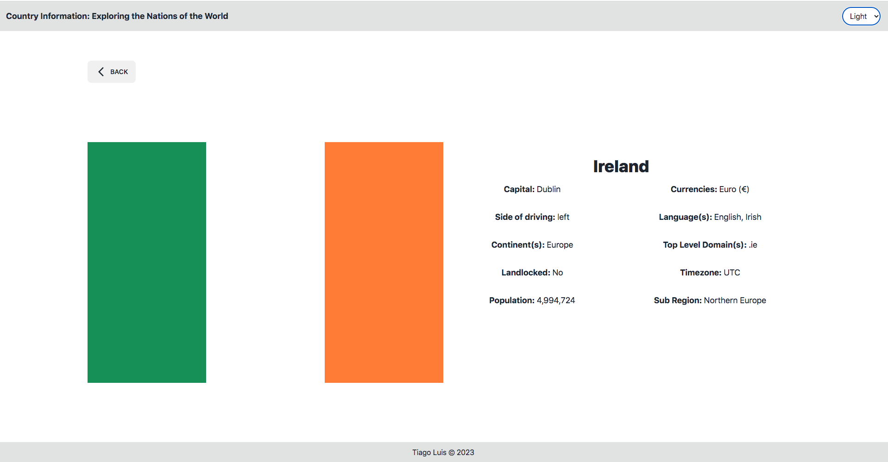
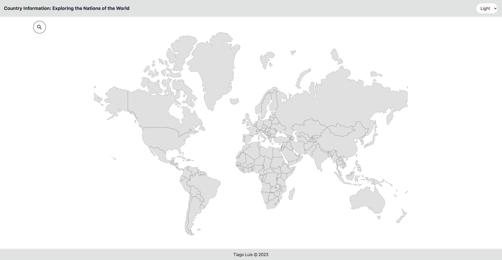
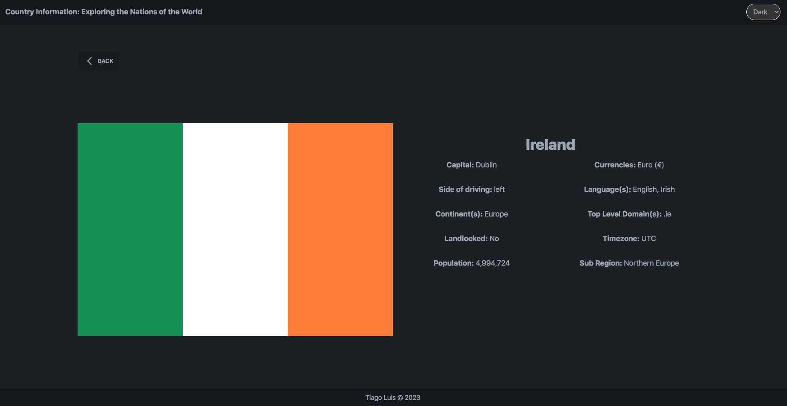
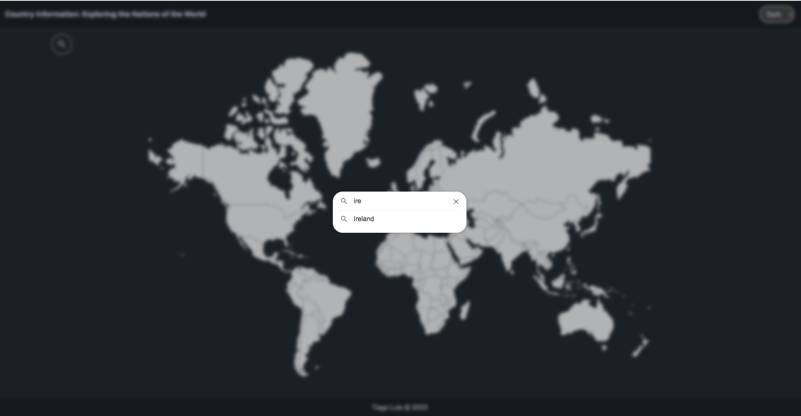

<a target="_blank" rel="noopener noreferrer" href="https://bounceinsights.com/wp-content/uploads/2020/06/method-draw-image-1.svg"></a>

<!-- PROJECT LOGO -->

<br />
<div align="center">
  <h1 align="center">Countrypedia: Exploring the Nations of the World</h3>
</div>

<!-- TABLE OF CONTENTS -->

## Contents

<p align="center">
    <p><a href="#about-the-project" title=" go to About the Project">About The Project</a></p>
    <p><a href="#running-locally" title=" go to Running locally">Running locally</a></p>
    <p><a href="#screenshots" title=" go to Screenshots">Screenshots</a></p>
    <p><a href="#features" title=" go to Features">Features</a></p>
    <p><a href="#contact" title=" go to Contact">Contact</a></p>
  </p>

<br>
<!-- ABOUT THE PROJECT -->

## About The Project

Explore the interactive world map and discover country data from around the globe.
This is the frontend part of the "Country Information" project By Bounce Insights. It provides an input and World Map to search for a country by name and a list of countries that match the search criteria. When a country is selected, it displays information about the country such as the capital, population, currency, etc. The project is built using React, Redux, Tailwind CSS, and react-svg-worldmap.

## Screenshots

### Light Theme




### Dark Theme




## Features

- Country data from REST COUNTRIES API
- Redux integration for caching of data for minimal api calls
- Search functionality for hard to locate countries with `react-search-autocomplete`
- Beautiful and Responsive UI with Tailwind CSS

<br>

# Running locally

```bash
# Clone this repository
$ git clone https://github.com/tiagoluis12/country-app
# Access the project folder in your terminal
$ cd countryinfo-react
# Install the dependencies
$ npm i
# Run the application
$ npm start
# The application will runing on port 3000, so you can access the url http://localhost:3000 to do the requests.
# Run Cypress tests
$ npx cypress open
```

# Contact

Tiago Luis - tiago7164@hotmail.com - [https://github.com/tiagoluis12/](https://github.com/tiagoluis12)

<p align="right">(<a href="#top">back to top</a>)</p>
